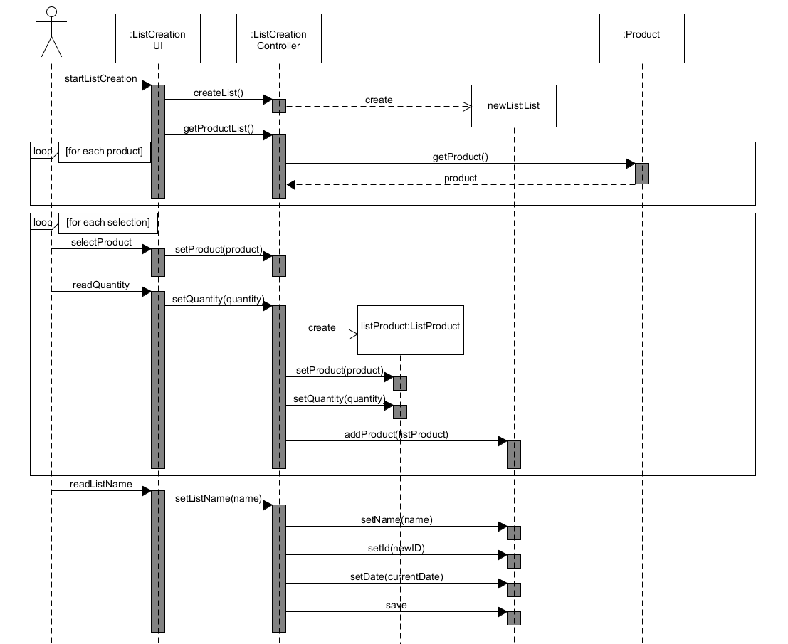
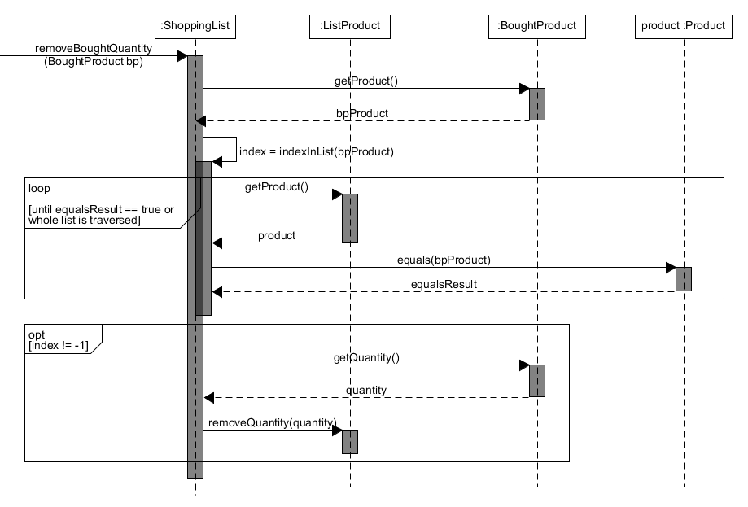

# ΠΧ1. Διαχείριση Λίστας Αγορών

**Πρωτεύων Actor**: Χρήστης  
**Ενδιαφερόμενοι**  
**Χρήστης**: Θέλει να δημιουργεί λίστες για τα προϊόντα που έχει ανάγκη να αγοράσει.  
**Προϋποθέσεις**: -

## Βασική Ροή

### Α) Δημιουργία Λίστας
1. Ο χρήστης επιλέγει τη δημιουργία νέας λίστας.
2. Το σύστημα εμφανίζει τα καταχωρημένα προϊόντα.
3. Ο χρήστης επιλέγει τα προϊόντα που επιθυμεί να προσθέσει, εισάγει την ποσότητά τους για τη συγκεκριμένη λίστα και επιβεβαιώνει την επιλογή του
4. Το σύστημα προτρέπει για το όνομα της λίστας.
5. Ο χρήστης εισάγει το όνομα της λίστας και ζητά τη δημιουργία της.
6. Το σύστημα επιβεβαιώνει τη μοναδικότητα του ονόματος.
7. Το σύστημα παράγει ένα μοναδικό κωδικό λίστας, εισάγει την τρέχουσα ημερομηνία ως ημερομηνία δημιουργίας και καταχωρεί τη λίστα.
8. Το σύστημα εμφανίζει μήνυμα επιτυχούς δημιουργίας και ενημερώνει το χρήστη για το κατάστημα με τη χαμηλότερη τιμή για τη συγκεκριμένη λίστα βάσει του πρόσφατου ιστορικού.

## Εναλλακτικές Ροές
3α. Δε βρέθηκε κάποιο από τα επιθυμητά προϊόντα
   1. [Ο χρήστης καταχωρεί το προϊόν στην εφαρμογή](uc2-product-management.md "Συμπερίληψη σεναρίου χρήσης [ΠΧ Διαχείριση Προϊόντων]/[Καταχώρηση προϊόντων]").  
Ο χρήστης επαναλαμβάνει το βήμα 1 για όσα προϊόντα επιθυμεί να καταχωρήσει.
   2. Η ΠΧ επιστρέφει στο βήμα 2 της βασικής ροής.

6α. Ο χρήστης δεν έχει εισάγει κάποιο όνομα για τη λίστα του  
   1. Το σύστημα εισάγει ως όνομα της λίστας ένα προεπιλεγμένο όνομα + τον επόμενο μοναδικό αύξοντα θετικό αριθμό.
   2. Η ΠΧ επιστρέφει στο βήμα 7 της βασικής ροής.
   
6β. Ο χρήστης έχει εισάγει όνομα που έχει αποδοθεί σε άλλη καταχωρημένη λίστα
   1. Το σύστημα εμφανίζει κατάλληλο μήνυμα σφάλματος.
   2. Η ΠΧ επιστρέφει στο βήμα 5 της βασικής ροής.

### Β) Προβολή Περιεχομένων / Τροποποίηση Λίστας
1. Ο χρήστης επιλέγει την προβολή περιεχομένων / τροποποίηση λιστών.
2. Το σύστημα εμφανίζει τις καταχωρημένες λίστες.  
    * 2α. Δεν έχει γίνει καταχώρηση κάποιας λίστας  
         i. Η ΠΧ τερματίζει.
3. Ο χρήστης επιλέγει τη λίστα που επιθυμεί να προβάλει / τροποποιήσει.
4. Το σύστημα εμφανίζει τα περιεχόμενα της λίστας.
5. Ο χρήστης προσθαφαιρεί προϊόντα ή/και τροποποιεί τις ποσότητές τους στη λίστα και ζητά την ενημέρωσή της.
6. Το σύστημα καταχωρεί τις αλλαγές.
7. Το σύστημα εμφανίζει μήνυμα επιτυχούς ενημέρωσης.

### Γ) Διαγραφή Λιστών
1. Ο χρήστης επιλέγει τη διαγραφή λιστών.
2. Το σύστημα εμφανίζει τις καταχωρημένες λίστες.  
    * 2α. Δεν έχει γίνει καταχώρηση κάποιας λίστας  
         i. Η ΠΧ τερματίζει.
3. Ο χρήστης επιλέγει τις λίστες που επιθυμεί να διαγράψει και ζητά την αφαίρεσή τους.
4. Το σύστημα προτρέπει για επιβεβαίωση των επιλογών.
5. Ο χρήστης επιβεβαιώνει τις επιλογές του.
   * 5α. Ο χρήστης ακυρώνει το αίτημα αφαίρεσης των επιλεγμένων λιστών.  
         i. Η ΠΧ επιστρέφει στο βήμα 3
6. Το σύστημα διαγράφει τις επιλεγμένες λίστες.
7. Το σύστημα εμφανίζει μήνυμα επιτυχούς διαγραφής.

## Διαγράμματα

### Διάγραμμα δραστηριότητας - Δημιουργία Λίστας

### Διάγραμμα ακολουθίας - Δημιουργία Λίστας

### Διάγραμμα ακολουθίας - Έλεγχος ικανοποίησης λίστας

### Διάγραμμα ακολουθίας - Αφαίρεση αγορασμένης ποσότητας

