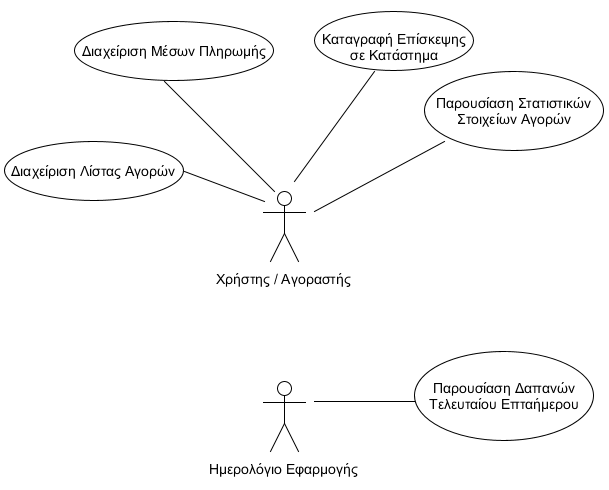

# Εφαρμογή Διαχείρισης Πορτοφολιού

-----------

## Απαιτήσεις
Στόχος της εφαρμογής είναι η υποστήριξη λειτουργιών οργάνωσης τρεχόντων / μελλοντικών αγορών και δαπανών, καθώς και η παροχή συμβουλευτικών υπηρεσιών που βασίζονται σε αγορές του παρελθόντος. Πιο συγκεκριμένα:

* Ο χρήστης θα μπορεί να καταχωρεί τόσο τις πιστωτικές/ανάληψης κάρτες που χρησιμοποιεί για τις αγορές του, όσο και τα μετρητά που διαθέτει.

* Θα δίνεται η δυνατότητα δημιουργίας, τροποποίησης, διαγραφής λιστών με προϊόντα που επιθυμεί να αγοράσει ο χρήστης.

* Όσον αφορά την επίσκεψη σε κατάστημα, ο χρήστης θα μπορεί να:
 1. αφαιρεί ανά πάσα στιγμή από τη λίστα το προϊόν που έβαλε στο καλάθι του (αν αυτό υπάρχει σε κάποια)
 2. καταγράφει την τιμή του προϊόντος που έβαλε στο καλάθι του ώστε αυτή να προστεθεί στο σύνολο εξόδων της τρέχουσας επίσκεψής
 3. αποθηκεύει τα στοιχεία της επίσκεψής του όταν αυτή ολοκληρωθεί (τιμές μεμονωμένων προϊόντων και κατάστημα)
 4. επιλέξει με ποιο τρόπο πλήρωσε, και να ανανεώνει το χρηματικό υπόλοιπο
 

* Ο χρήστης θα μπορεί να ενημερώνεται για στατιστικά στοιχεία παρελθοντικών του αγορών επιλέγοντας κάθε φορά από ένα menu την κατηγορία στατιστικής που τον ενδιαφέρει.

* Στην αρχή κάθε εβδομάδας, ο χρήστης θα ενημερώνεται από την εφαρμογή με notification για τα συνολικά έξοδα του περασμένου επταήμερου.

* Η εφαρμογή θα διαθέτει μηχανισμούς ώστε:

  - κατά την ολοκλήρωση δημιουργίας μιας λίστας να προτείνεται στον χρήστη το κατάστημα με το χαμηλότερο συνολικό κόστος βάσει πρόσφατων αγορών
  - κατά την επίσκεψή του σε ένα κατάστημα, ο χρήστης να προειδοποιείται αν το κόστος των αγορών του πλησιάζει / ξεπερνά το υπόλοιπο του επιλεγμένου μέσου πληρωμής

## Use case diagram

